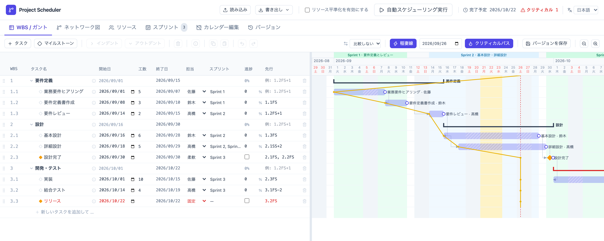
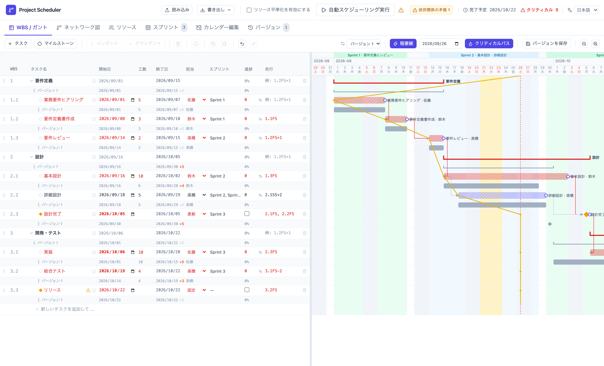
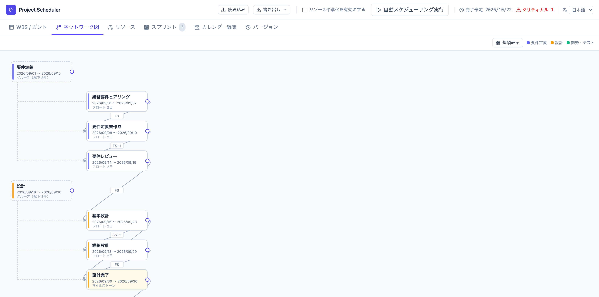
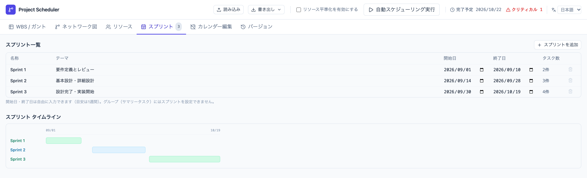

English | [日本語](README.ja.md)

# Project Scheduler

> A local-first, single-file project scheduling simulator with WBS/Gantt planning, CPM, resource leveling, fixed milestones, sprints, and AI-assisted replanning.

Project Scheduler helps you test project plans against dependencies, milestones, sprint windows, and resource capacity. It runs entirely in your browser from a single HTML file, with no server or account required.

[Live Demo](https://lhideki.github.io/project-scheduler/) | [Downloadable HTML](project_scheduler.html) | [Feature Overview (Japanese)](https://www.inoue-kobo.com/webservice/project-scheduler/) | [Hands-on Tutorial (Japanese)](https://www.inoue-kobo.com/webservice/tutorial-project-scheduler/) | [JSON Format](docs/json-format.md)



## What it is for

Project Scheduler is a planning simulator, not a replacement for collaborative tools such as Jira or Backlog. Use it before entering tasks into those systems, or when a plan changes and you need to explore the impact of dependencies, fixed dates, and resource conflicts.

- Change estimates or dependencies and recalculate downstream dates.
- Identify critical tasks by viewing the critical path and float.
- Resolve overlapping assignments against weekly and monthly resource capacity.
- Keep planning data in your browser instead of sending it to an external service.

## Try it in 3 minutes

1. Open the [Live Demo](https://lhideki.github.io/project-scheduler/).
2. In the sample WBS, change the effort for `基本設計` (Basic Design) from `6` to `10`.
3. Select `自動スケジューリング実行` (Run Auto Scheduling) in the upper-right corner.
4. Check how the downstream dates, projected completion date, and critical path change.

No build or installation is required. For offline use, open [project_scheduler.html](project_scheduler.html), select `Download raw file` on GitHub, and open the downloaded file in your browser.

To move a plan between devices, or between the Live Demo and the downloaded HTML, export it as JSON from the header and import it in the other environment.

## Features

- Edit a WBS as an outline and view its Gantt chart against a working-day calendar that accounts for weekends and Japanese public holidays.
- Navigate cells with the arrow keys, copy and paste individual cells or rows, and use Undo and Redo.
- Model all four dependency types (FS, SS, FF, and SF) with lead and lag offsets.
- Calculate and visualize float and the critical path with the Critical Path Method (CPM).
- Switch milestones between flexible mode, scheduled forward from dependencies, and fixed mode, scheduled backward from a due date.
- Automatically level resources against weekly and monthly capacity limits.
- Define sprints with start dates, end dates, and themes, and assign multiple sprints to a task.
- Flag conflicts between sprint windows and calculated task dates.
- Inspect dependencies in a network (PERT) view and copy the graph as Mermaid syntax.
- Save snapshots, compare multiple versions on a Gantt-style timeline, and restore an earlier state.
- Export and import the complete project, including tasks, resources, sprints, and version history, as JSON.
- Use the included Claude Code Skill to let an AI agent adjust an exported plan directly. See [AI-assisted replanning](#ai-assisted-replanning).

<details>
<summary>See more screens</summary>

### Version comparison



### Network view



### Sprint definition



</details>

## Data storage

When opened in a regular browser, the app automatically saves changes to that browser's `localStorage` after about 0.8 seconds. Data stays in that browser and on that device; it is not synchronized automatically with other browsers or devices.

Private browsing or clearing site data may delete the saved plan. Export important plans to JSON regularly as a backup.

## Link a JSON file from a synced folder

You can link a JSON file synchronized by a desktop client such as Dropbox, Google Drive, or OneDrive by adding a `schedule` query parameter to the URL. The query value does not grant access to a local path. It is only a key that the browser uses to identify a file you explicitly select.

```text
project_scheduler.html?schedule=%2FUsers%2Ftaro%2FDropbox%2Fschedules%2Fproject-a.json
```

1. URL-encode the user's local path and pass it as the `schedule` query value.
2. On the first visit, select `JSONを選択` (Choose JSON) and choose the local file associated with that query.
3. In browsers that support the File System Access API, the app stores the file association in IndexedDB. It can reopen the file on later visits while permission remains available.
4. Select `最新版を再読込` (Reload Latest) to reopen the synchronized file after it changes.

While a linked JSON file is open, edits are not automatically saved to `localStorage`. You must select the file again if the browser does not support the File System Access API or if permission is lost. A real local path in an HTTP(S) URL may appear in access logs, so use a logical key such as a project name if the path is sensitive.

## AI-assisted replanning

The repository includes the `schedule-adjust` Skill for Claude Code. It reads and writes exported Project Scheduler JSON (`schemaVersion: 1`), so you can ask an AI agent to handle requests such as:

- "Move this task back by two weeks and reschedule its dependents."
- "Level the plan so that the same person is not assigned to overlapping tasks."
- "Replan around a delay in work that has already started."

The included CLI (`.claude/skills/schedule-adjust/cli.mjs`) performs CPM recalculation, resource leveling, validation, and impact reporting. It requires Node.js 18 or later and no additional installation. The CLI itself does **not** overwrite JSON files. The Skill first reports the proposed changes, asks for approval, and writes them only after approval. Before writing, it saves the previous state in a `versions[]` snapshot that you can compare or restore in the app.

### Install the Skill

When Claude Code is opened in this repository, `.claude/skills/schedule-adjust/` is available automatically as a project Skill. To use it elsewhere, install it as a Claude Code plugin:

```shell
/plugin marketplace add lhideki/project-scheduler
/plugin install schedule-adjust@project-scheduler
```

### Move changes between the agent and the app

If you linked a local JSON file as described in [Link a JSON file from a synced folder](#link-a-json-file-from-a-synced-folder), select `最新版を再読込` (Reload Latest) after the agent edits it. Otherwise, export a JSON file, have the agent edit it, and import the result back into the app.

### Sync with Backlog

The same plugin bundles a second Skill, `backlog-sync`, that keeps an exported plan and a
[Backlog](https://backlog.com/) project in sync through [`bee`](https://github.com/nulab/bee),
Nulab's official Backlog CLI. Install `bee` 1.1 or later and authenticate it first
(`npm i -g @nulab/bee`, then `bee auth login`).

- **Scheduler → Backlog**: create or update issues from the plan. Computed start and due
  dates come from `schedule-adjust`'s `recalc`, so the JSON format is unchanged.
- **Backlog → Scheduler**: read issue status back into `progress`, then hand off to
  `schedule-adjust` to replan and save.

Sync settings and the task-to-issue mapping live in a sidecar file next to the exported
JSON (`<file>.backlog.json`); the Project Scheduler JSON schema itself is not touched.
The Skill always shows a diff and asks for approval before writing to Backlog, and never
deletes issues automatically. See `.claude/skills/backlog-sync/` for the mapping template.

## JSON format

See the [JSON format reference](docs/json-format.md) for fields, types, and required properties. The reference is generated from the JSON Schema in the source code.

Imports currently accept only `schemaVersion: 1`. Older JSON formats are not supported.

## Development and rebuilding

`project_scheduler.html` is a generated artifact. The build bundles the React source from `src/entry.jsx` with [esbuild](https://esbuild.github.io/) and embeds it with the [Tailwind CSS](https://tailwindcss.com/) output into a single HTML file. Do not edit the generated HTML directly; rebuild it after changing the source.

Pushing to `master` runs the tests and build in GitHub Actions, then publishes the generated HTML to the [Live Demo](https://lhideki.github.io/project-scheduler/) on GitHub Pages.

### Requirements

- Node.js 18 or later

### Setup and verification

```bash
npm install
npm run test
npm run build
```

`npm run build` runs these five steps:

| Command | Output |
| --- | --- |
| `npm run build:js` | Bundles and minifies `src/entry.jsx` into `dist/bundle.js`. |
| `npm run build:css` | Generates `dist/output.css` from `src/input.css`. |
| `npm run build:html` | Embeds the JavaScript and CSS into `template.html` and generates `project_scheduler.html`. |
| `npm run build:docs` | Generates `docs/json-format.md` from the JSON Schema in the source code. |
| `npm run build:agent` | Bundles `src/agent/cli.js` into `.claude/skills/schedule-adjust/cli.mjs`. |

### Project structure

```text
.
├── src/
│   ├── App.jsx              # Application state and top-level composition
│   ├── components/          # UI components, including WBS and Gantt views
│   ├── lib/                 # CPM, calendar, dependencies, JSON logic, and tests
│   ├── dom/                 # DOM helpers such as pointer dragging
│   ├── agent/               # Skill CLI, reusing the scheduling logic in src/lib
│   ├── entry.jsx            # React entry point
│   ├── input.css            # Tailwind CSS input
│   └── storage.js           # window.storage and localStorage integration
├── scripts/                 # HTML, JSON documentation, and Skill CLI generators
├── docs/                    # JSON reference and README images
├── .claude/skills/          # Claude Code Skills (schedule-adjust, backlog-sync)
├── .claude-plugin/          # Plugin marketplace metadata
├── template.html            # Source template for the distributable HTML
└── project_scheduler.html   # Generated distributable
```

## Known limitations

- Real-time multi-user editing and automatic cross-device synchronization are not supported. Use JSON export and import to share or transfer a plan.
- The working-day calendar uses a simplified implementation of Japanese public holidays.

## Feedback

Please report bugs and feature requests in [GitHub Issues](https://github.com/lhideki/project-scheduler/issues). If Project Scheduler is useful to you, a Star is always appreciated.

## License

[MIT License](LICENSE)
