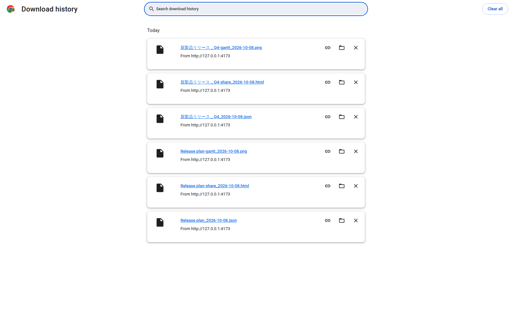
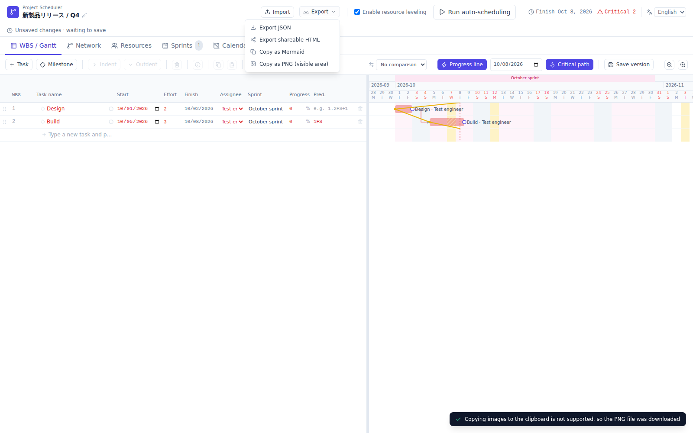

# Issue #55: export filename verification

These are unedited screenshots from the real browser regression run, using synthetic data.

- CI: https://github.com/lhideki/project-scheduler/actions/runs/37754580026
- Tested PR head: `c94dcd1e7f3ad47e99f55cb9013bad7c0e6371ce`
- GitHub test merge: `c8888a6295e20d8d4be4289e2e3a868660ede857`
- Result: 534 unit tests and 56 browser tests passed on the first attempt.
- Source artifact: https://github.com/lhideki/project-scheduler/actions/runs/37754580026/artifacts/11538997897
- Artifact SHA-256: `d57f771f189949439fae9d94850274b54b0e64cf2dabec313a82fea3ca54f39c`

## Actual browser download history

The test exported all three formats for `Release plan` and `新製品リリース / Q4`. It checked the browser's `suggestedFilename`, downloaded bytes, and filename text in Chromium's real `chrome://downloads` page before taking this screenshot. The slash becomes `_` only in the filename; the stored and exported project name is unchanged. The test uses a fixed date (2026-10-08 UTC) and an isolated disposable Chromium profile. It does not inspect or modify a user's browser or downloads.

## Export menu after the change

The filename tests also cover unnamed/invalid-only fallbacks, long Unicode names, draft cancellation, repeated renames, shared HTML re-export, linked-file preservation, PNG clipboard success/unavailable/rejected, and a rename while PNG export is awaiting clipboard permission. Windows device-name sanitization is covered by unit tests; native Windows/macOS save dialogs were not exercised. Local browser execution was blocked before assertions by the cloud shell's Unix-socket restriction; the browser evidence above comes from GitHub CI.
