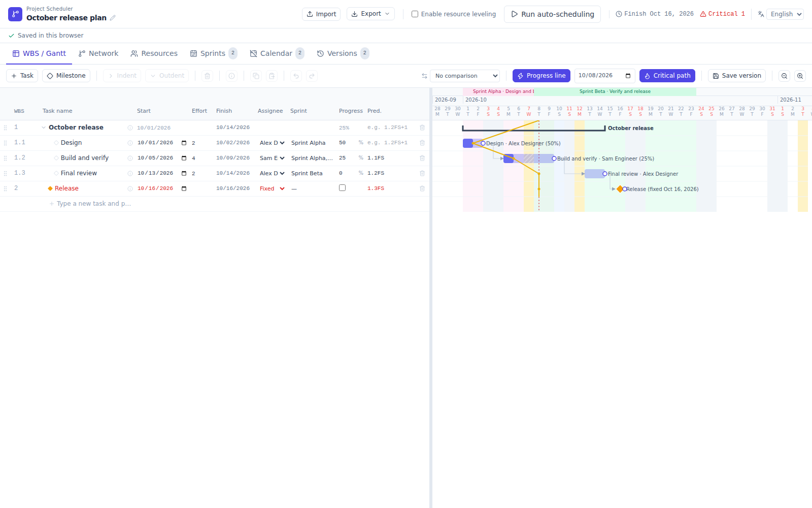
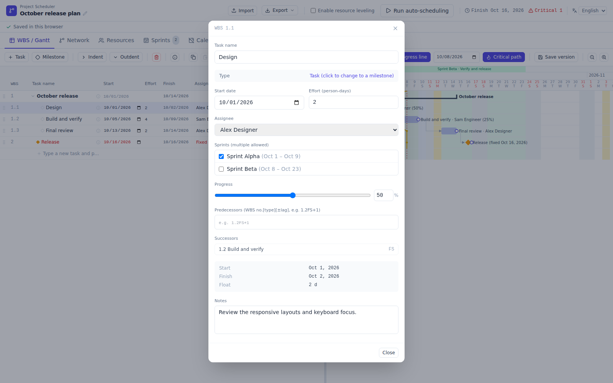
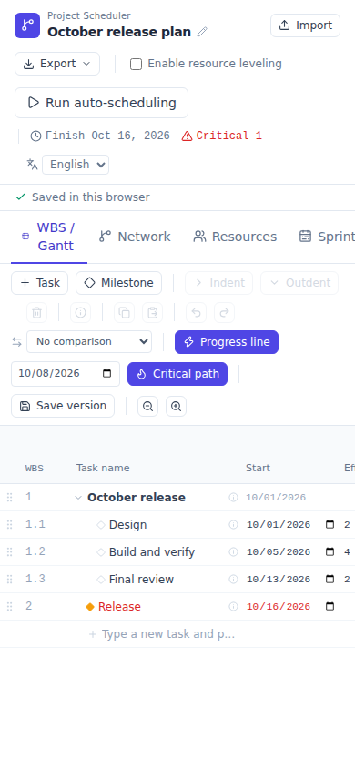

# PR #57: Tailwind CSS 4 migration verification

## Verified build

- Candidate: `da2caf0d9de1bd6d221036f1c9ac886bb523a040`
- Baseline: `e029cc66e2e806e01c040780ebc7e70c5b360384` (the previous master, including #56 and #58)
- [CI run](https://github.com/lhideki/project-scheduler/actions/runs/37763708551): 538 unit tests and 80 browser tests passed on the first attempt at this head. Build, generated-file consistency and Pages generation also passed. Dependency installation reported zero audit vulnerabilities.
- [Original browser evidence](https://github.com/lhideki/project-scheduler/actions/runs/37763708551/artifacts/11543945733)
- Evidence ZIP SHA-256: `2fc06f5208b43c765b22a7eace5f713884c5dbbda07faece515940a32ace40e8`
- [Machine-readable comparison summary](verification.json)

The screenshots below are unedited captures of synthetic data. The candidate HTML checksum in the comparison reports matches the committed standalone HTML.

## Actual screenshots

### WBS before migration

### WBS after migration

### Task details after migration

### Narrow viewport after migration

## Comparison method and limits

The 24 comparisons cover 12 states at 1600×1000 and 390×844: WBS/Gantt, English/Japanese export menus, focused project-name editing, task details, Network, dependency warnings, Resources, confirmation dialogs, Sprints, Calendar and Versions. Both versions use the same browser build, fixed clock and data; the original v3 HTML is checksum-verified. They run without external requests.

Every measured rectangle and comparable computed style matched. Tailwind's space-y margin redistribution is compared using the physical sibling gaps and rectangles; raw margins remain recorded. The explicit geometry/property/color allowlists in computedEvidence are compared directly, including the outer logo box. Box shadows, background images and raw color serialization are diagnostic-only; their rendered effects are covered by the pixel gate below. This does not compare every available CSS property.

The image gate uses Pixelmatch with threshold 0 and includeAA false: no color-distance tolerance, region masks or non-AA changed-pixel allowance. Raw RGBA differences and independent v3-v3 controls are retained. This is **not a claim of universal pixel identity**: 21 states were byte-for-pixel identical after PNG decoding; the three remaining narrow-view states had 3 (dependency dialog), 21 (export menu) and 4 (focused rename) raw differing pixels, all classified as antialiased edges, with zero non-AA changes. The largest raw channel difference was 17 at a rounded corner. Actual screenshots were also visually inspected.

The existing 56 browser cases cover functionality such as save/import safety, Undo/Redo, scheduling feedback, linked/shared projects and export filenames. Browser execution was in Chromium 153 on GitHub CI; native Safari/Firefox and OS save dialogs were not run. Narrow-view clipping already present in the baseline, including the export-menu clipping, is unchanged; these comparisons establish migration parity, not a responsive-layout redesign.

## Dependency and build changes

The migration uses the separate @tailwindcss/cli 4.3.3 package, explicit JSX source detection, v3-compatible sRGB colors/fonts/line heights, renamed utilities, and targeted native-control/table/outline compatibility rules. See the [official upgrade guide](https://tailwindcss.com/docs/upgrade-guide) for browser requirements and framework changes.

The scoped @parcel/watcher 2.5.6 override removes the old micromatch/braces chain while retaining the watcher API. See the [upstream patch release](https://github.com/parcel-bundler/watcher/releases/tag/v2.5.6). Clean installation, native module loading, deterministic CSS generation and the full build passed. Remove the override when the upstream CLI resolves a safe watcher without it and verification remains clean.
